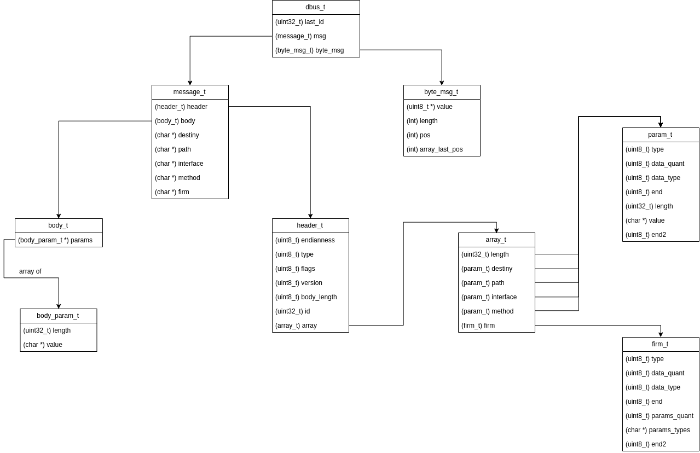

# Nombre: Francisco Hermani

# Padrón: 98223

Link GitHub: https://github.com/franhermani/taller-tp1

# Resolución del TP

### TDA Socket

Mi resolución del TP comenzó con la implementación del TDA Socket en su totalidad.

Para ello, leí las diapositivas, vi la clase grabada nuevamente e hice uso de
documentaciones online y del comando *man*.

Básicamente, lo que hice fue ir testeando las funciones desde el lado del cliente
y del servidor; pero no entre ellos, sino de cada uno contra una instancia de *netcat*.

Una vez que estuve satisfecho con el comportamiento de ambos por separado,
procedí a testearlos en conjunto, hasta afinar los detalles que fueron surgiendo.

En el momento en que el par cliente-servidor se enviaba mensajes correctamente
comencé con la implementación del protocolo D-Bus.

### Protocolo D-Bus

Comencé leyendo atentamente el enunciado e investigando en la Web, pero mi principal
herramienta de trabajo para entender el protocolo fue el video subido por Matías
al grupo de Google.

Pausándolo a cada byte nuevo, empecé creando todos los *structs* que componen el protocolo.
Así, logré una estructura de *structs* anidados que será explicada más adelante.

Luego, procedí a escribir funciones para completar dichos *structs*, de forma
modularizada y ordenada, para un mejor seguimiento.

Para debuggear que la tira de bytes se estuviera escribiendo correctamente,
armé una función que imprimía byte a byte en código hexadecimal, de modo tal
que pude analizar todos los casos borde de padding y demás.

Una vez que la tira de bytes se armaba y enviaba correctamente, procedí a decodificarla
desde el lado del servidor.

Para ello, reutilicé los *structs* creados, pero creé nuevas funciones para
interpretar la tira de bytes según el protocolo.

### Refactorización

Una vez corroborado el correcto funcionamiento del TP con los casos de pruebas
provistos por el SERCOM, pasé a una etapa final de refactorización general,
la cual incluyó:

- Modularización de funciones
- Correcta asignación de responsabilidades
- Creación de las entidades *client* y *server* como tales, con sus atributos
  y funciones correspondientes
- Lectura del archivo de entrada en bloques de 32 bytes, haciendo uso
  del TDA Dynamic Buffer
- Redimensionamiento de la tira de bytes creada por el cliente a medida
  que se van agregando elementos a ella
- Creación del Endianness Converter, para transformar enteros de little
  a big endian, y viceversa

# Puntos de interés

### Estructuras

### Protocolo D-Bus

La estructura del protocolo D-Bus está definida en el archivo *common_dbus.h*.

El siguiente diagrama la explica detalladamente:

Desde el lado del cliente se hace uso de las funciones definidas en *client_dbus.c*,
el cual tiene su propio *.h*.

Desde el lado del servidor se hace uso de las funciones definidas en *server_dbus.c*,
el cual también tiene su propio *.h*.

Sin embargo, ambos utilizan la estructura común definida en *common_dbus.h*.

Esto fue modelado así por los siguientes motivos:

- Evitar repetir una estructura que es común a ambos
- Evitar tener un *.c* extremadamente largo con la mitad de las funciones
  utilizadas por el cliente y la otra mitad por el servidor
  
Cabe destacar que tanto el *client_dbus* como el *server_dbus* tienen una
gran cantidad de funciones bien modularizadas, cada una encargada de construir
o leer la sección de la tira de bytes correspondientes.

En el caso del *client_dbus*, primero se procede a construir las estructuras
a partir de la línea del archivo leída. Esto facilita la posterior escritura
de la tira de bytes.

En el caso del *server_dbus* ocurre algo similar, pero con menor complejidad,
ya que lo único que interesa son los valores de los parámetros del array.
En este sentido, se construyen solo las estructuras necesarias para el output
solicitado.  
  
### Envío y recepción de datos por parte del cliente

### Recepción y envío de datos por parte del servidor  

# Aclaraciones

Al momento de esta entrega, hay algunas funciones que pueden considerarse largas
por superar las 20 líneas de código.

A continuación se las enumera y justifica su longitud:

- *main()* del *client.c*. Su longitud se debe a la necesidad de destruir objetos
creados en caso de que alguna de las funciones intermedias devuelva un error.
Esto se relaciona con el manejo poco elegante de errores que tiene C,
a diferencia de C++.

- *socket_resolve_addr()*. Esta función recibe un socket, un host y un puerto
y obtiene las direcciones disponibles para los parámetros dados, haciendo uso
de *getaddrinfo()*. Su extensa longitud se debe a que luego realiza una u otra
acción dependiendo si se trata de un socket cliente o servidor. En el caso del
primero, realiza un *connect()*. En el caso del segundo, realiza un *bind()*.
La ventaja es que ambas llamadas se encuentran dentro del loop de las
direcciones, de modo tal que si alguna falla, puede intentar con la siguiente
dirección disponible.

- *dbus_build_body()*. Esta función recibe un *struct dbus* y una tira de bytes
desde el lado del servidor y construye los *structs* correspondientes al cuerpo
del mensaje recibido. Su extensa longitud se debe a que estos *structs* tienen
varios niveles jerárquicos, los cuales deben ser recorridos y completados con
los loops correspondientes.

- Por último, algunas de las funciones de *client_dbus.c* superan las 20 líneas
principalmente porque, al llamar a la función *dbus_resize_byte_msg()* para
redimensionar la tira de bytes para poder escribir los nuevos bytes, tienen que
calcular el tamaño que ocuparán los próximos bytes. Este cálculo puede llevar
varias líneas de código ya que debe aplicarse *sizeof()* a cada elemento del *struct*
correspondiente.
